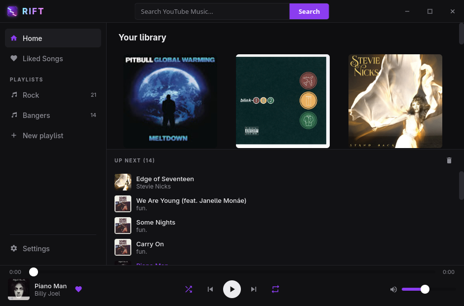

# Rift

[](https://github.com/gage-lodba/Rift/actions/workflows/ci.yml)

A minimal, ad-free desktop music player, written (almost) entirely in Rust.



- **Backend:** Tauri 2, tokio, rodio (playback), rustypipe (streaming backend), serde, tracing
- **Frontend:** Yew (Rust → WASM), built with Trunk

No ads, no tracking, no account. Features:

- Search songs, artists, and albums; browse artist pages (top songs, full
  discography split into albums and singles) and album pages.
- Auto-generated radio queues for endless playback, with shuffle and repeat.
- Like songs, build and manage playlists, and resume your session on next launch.
- Download tracks for offline listening.
- Crossfade between tracks, OS media-key / now-playing integration, and Discord
  Rich Presence.
- Filters out music-video versions so results stay audio-only.
- Built-in yt-dlp detection (with one-click install) and an update checker.

## Download

Grab the installer for your platform from the
[latest release](https://github.com/gage-lodba/Rift/releases/latest) — `.AppImage`,
`.deb` or `.rpm` for Linux, `.dmg` for macOS, `.msi` or `.exe` for Windows.
Playback needs [yt-dlp](https://github.com/yt-dlp/yt-dlp) (see below); Rift
detects it automatically and can install it for you from **Settings** if it's
missing.

To build from source instead, read on.

## Requirements

| Dependency | Why | Install (Arch) |
|---|---|---|
| Rust + cargo | everything | `pacman -S rustup` |
| `wasm32-unknown-unknown` target | Yew frontend | `rustup target add wasm32-unknown-unknown` |
| [Trunk](https://trunkrs.dev) | WASM bundler | `cargo binstall trunk` (prebuilt) or `cargo install trunk` |
| webkit2gtk-4.1 | Tauri webview | `pacman -S webkit2gtk-4.1` |
| ALSA | audio output | preinstalled on most systems |
| [yt-dlp](https://github.com/yt-dlp/yt-dlp) | stream fetching (see below) | `pacman -S yt-dlp` |

## Build & run

The frontend must be built first: the Tauri backend embeds `./dist` at compile time,
so `cargo run` picks up whatever the last `trunk build` produced.

```sh
# 1. build the frontend (outputs to ./dist)
cd ui && trunk build --release && cd ..

# 2. run the app
cd src-tauri && cargo run --release
```

For a distributable bundle, install `tauri-cli` (`cargo install tauri-cli`) and run
`cargo tauri build`.

## How streaming works (and why yt-dlp is needed)

Rift uses [rustypipe](https://crates.io/crates/rustypipe) for search, metadata and
radio queues, and tries it first for audio streams too. As of mid-2026 rustypipe
0.11.4 can no longer resolve full audio streams on its own (upstream has been
dormant since mid-2025), so Rift transparently falls back to invoking
[yt-dlp](https://github.com/yt-dlp/yt-dlp) to fetch the m4a audio. Everything else
— UI, queue, playback, library — stays in Rust. If a future rustypipe release
restores stream resolution, Rift will use it automatically without any changes.

You can verify the streaming pipeline from the command line:

```sh
cd src-tauri && cargo run --example probe -- your search terms
```

## Data

Your library (liked songs, playlists, recently played) is stored as JSON in
`~/.local/share/dev.jerimiah.rift/library.json`. Logs follow `RUST_LOG`
(default `rift=debug,rustypipe=info`).

## License

MIT
